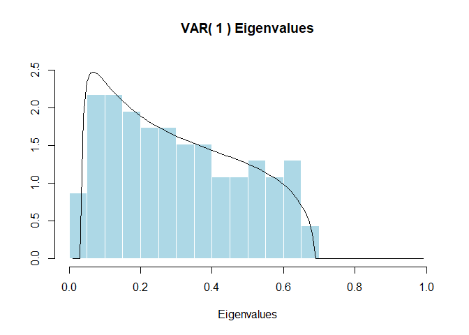
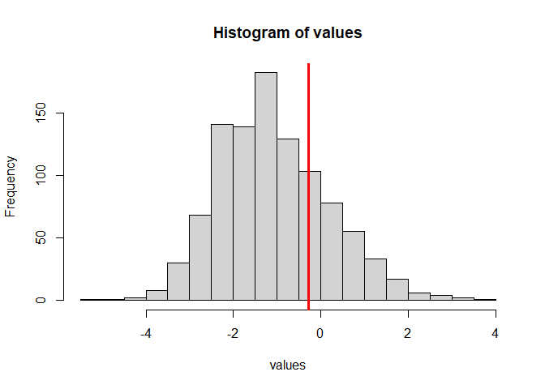

<!-- README.md is generated from README.Rmd. Please edit that file -->

# Largevars

The Largevars R package conducts a cointegration test for
high-dimensional vector autoregressions of order $k$ based on the large
$N,T$ asymptotics of Bykhovskaya and Gorin (2021,
<doi:10.48550/arXiv.2006.14179>), Bykhovskaya and Gorin (2022,
<doi:10.48550/arXiv.2202.07150>). The implemented test is a modification
of the Johansen likelihood ratio test. In the absence of cointegration
the test converges to the partial sum of the Airy$_1$ point process.
This package contains simulated quantiles of the first ten partial sums
of the Airy$_1$ point process that are precise up to the first $3$
digits.

## Installation

You can install the latest version of Largevars from Github:

``` r
library(devtools)
install_github("eszter-kiss/Largevars")
```

You can also install the latest CRAN release:

``` r
install.packages("Largevars")
```

## Example

The following example is a replication of the S&P100 example from
Bykhovskaya and Gorin (2022), Bykhovskaya and Gorin (2024).

We use logarithms of weekly adjusted closing prices of assets in the
S&P100 over ten years (01.01.2010-01.01.2020), which gives us $\tau=522$
observations across time. The S&P100 includes 101 stocks, with Google
having two classes of stocks. We use 92 of those stocks, those for which
data were available for our chosen time period. Only one of Google’s two
listed stocks is kept in the sample. Therefore, $N = 92$, $T = 521$ and
$T/N  \approx 5.66$. The data that we use are accessible from the `data`
folder in the package.

``` r
library(Largevars)

## load data
data("s_p100_price")

## Transform data according to researcher needs
dataSP <- log(s_p100_price[, seq(2, dim(s_p100_price)[2])])

## Turn data frame into numeric matrix to match function requirements
dataSP <- as.matrix(dataSP)

## Use the package documentation by calling help
?largevar

## Use largevar function. Save the function output (list)
result <- largevar(data = dataSP, k = 1, r = 1, fin_sample_corr = FALSE,
                   plot_output = TRUE, significance_level = 0.05)
```



``` r


## Display the result
result
#> Output for the largevar function 
#> ================================= 
#> Cointegration test for high-dimensional VAR(k)   T= 521 N= 92 
#> 
#>  10% Crit. value 5% Crit. value 1% Crit. value Test stat.
#>             0.45           0.98           2.02      -0.28
#> 
#> If the test statistic is larger than the quantile, reject H0. 
#> =============================================================== 
#> Test statistic: -0.2777314 
#> The p-value is  0.23 
#> Decision about H0:  0
```

If we want to individually access certain values from the output list,
we can do it in the usual way, by referencing the elements of the list:

``` r
result$significance_test$p_value
#> [1] 0.23
result$significance_test$boolean_decision
#> [1] 0
result$significance_test$significance_table
#>      10% Crit. value 5% Crit. value 1% Crit. value  Test stat.
#> r=1             0.45           0.98           2.02  -0.2777314
#> r=2            -1.87          -1.09           0.42  -1.4995879
#> r=3            -5.90          -4.90          -2.99  -5.4154889
#> r=4           -11.35         -10.15          -7.87 -10.5527603
#> r=5           -18.07         -16.69         -14.07 -16.7460847
#> r=6           -25.95         -24.40         -21.45 -23.2178976
#> r=7           -34.90         -33.19         -29.95 -31.1080001
#> r=8           -44.88         -43.01         -39.47 -39.3197363
#> r=9           -55.82         -53.80         -49.99 -49.8419822
#> r=10          -67.70         -65.53         -61.45 -60.4894485
```

If we want to see an empirical p-value, we can use the function below.
By default, it will print a message to console to remind the user that
precise computations of the statistics need a large number of simulation
iterations. We can suppress this message the usual way, by using the
`suppressMessages()` wrapper. We can set a seed for the simulation by
specifying a number for input `seed`.

``` r
## sim_function for empirical p-values
result2 <- sim_function(N = 92, tau = 522, stat_value = result$statistic,
                        k = 1, r = 1, fin_sample_corr = FALSE, sim_num = 1000, seed = 333)
#> Warning in check_input_simfun(N, tau, stat_value, k, r, fin_sample_corr, :
#> Simulation may run for several minutes
#> This function should only be used for quick approximate assessments, as precise computations of the statistics need much larger numbers of simulations.
```



``` r

## To provide the function while suppressing messages:

# result3 <- suppressMessages(sim_function(N=92,tau=522,stat_value=-0.2777,k=1,r=1,
#              fin_sample_corr = FALSE,sim_num=1000, seed = 333))
```

## Authors

Anna Bykhovskaya (Duke University) anna.bykhovskaya@duke.edu

Vadim Gorin (University of California at Berkeley) vadicgor@gmail.com

Eszter Kiss (Duke University) ekiss2803@gmail.com

## Cite our package

``` r
citation("Largevars")
#> To cite Largevars in publications use:
#> 
#>   Bykhovskaya A, Gorin V, Kiss E (2024). "Largevars: An R Package for
#>   Testing Large VARs for the Presence of Cointegration." _TBD_.
#> 
#> A BibTeX entry for LaTeX users is
#> 
#>   @Article{largevarspaper,
#>     title = {Largevars: An R Package for Testing Large VARs for the Presence of Cointegration},
#>     author = {Anna Bykhovskaya and Vadim Gorin and Eszter Kiss},
#>     journal = {TBD},
#>     year = {2024},
#>   }
```

## License

MIT License (c) 2024
